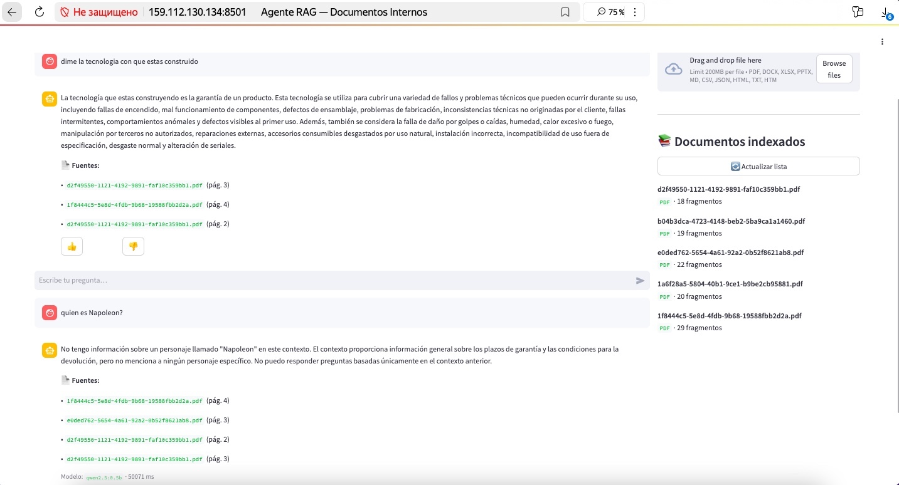
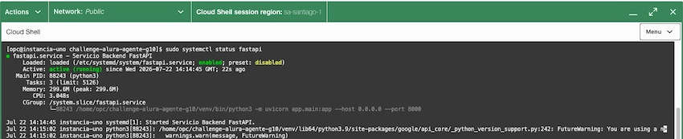
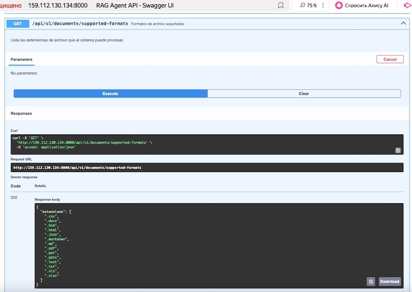

# Asistente RAG — Challenge Alura Agente G10


-blueviolet)


> Agente de IA que responde preguntas en lenguaje natural sobre los documentos internos de tu empresa. Construido con RAG (Retrieval-Augmented Generation), FastAPI, Qwen2.5 y Chroma. Diseñado para correr en Oracle Cloud Free Tier sin costo.

---

## Índice

- [Título e imagen de portada](#asistente-rag--challenge-alura-agente-g10)
- [Índice](#índice)
- [Descripción del proyecto](#descripción-del-proyecto)
- [Estado del proyecto](#estado-del-proyecto)
- [Funcionalidades](#funcionalidades)
- [Cómo usar el proyecto](#cómo-usar-el-proyecto)
  - [Correr en local](#correr-en-local)
  - [Desplegar en Oracle Cloud Free Tier](#desplegar-en-oracle-cloud-free-tier)
- [Stack tecnológico](#stack-tecnológico)
- [Estructura del proyecto](#estructura-del-proyecto)
- [API — Endpoints principales](#api--endpoints-principales)
- [Tests](#tests)
- [Construido con Kiro SDD](#construido-con-kiro-sdd)
- [Autores](#autores)
- [Licencia](#licencia)

---

## Descripción del proyecto

Este proyecto es un **asistente de IA basado en RAG** que permite a los empleados de una empresa ficticia consultar documentos internos en lenguaje natural. En lugar de buscar manualmente en PDFs o archivos de Excel, el usuario hace una pregunta y el agente responde con la información exacta junto con la fuente de donde la extrajo.

El proyecto fue desarrollado como parte del **Challenge AluraAgente — ONE IA FOR TECH G10**, con el objetivo de construir una API con FastAPI que procese documentos, los indexe en un vector store local y permita hacer preguntas sobre su contenido.

El flujo completo es:

```
Usuario sube documento → Parser extrae texto → Chunking → Gemini genera embeddings → Chroma guarda vectores
                                                                                              ↓
Usuario hace pregunta → Embedding de la pregunta → Chroma busca chunks similares → Qwen2.5 genera respuesta
                                                                                              ↓
                                                                          Respuesta + fuentes al usuario
```

---

## Estado del proyecto

**Completado** — API funcional con todos los endpoints, interfaz Streamlit, logging JSONL y suite de tests.

---

## Funcionalidades

- **Subida de documentos**: acepta PDF, DOCX, XLSX, PPTX, Markdown, CSV, JSON, HTML y TXT
- **Indexación automática**: extrae texto, limpia, divide en chunks y genera embeddings con Gemini
- **Actualización de documentos**: resubir un archivo reemplaza automáticamente la versión anterior sin reiniciar el servidor
- **Preguntas en lenguaje natural**: el agente busca los fragmentos más relevantes y genera una respuesta con Qwen3
- **Citas de fuente**: cada respuesta incluye el documento, sección y página/diapositiva de origen
- **Historial de conversación**: la interfaz Streamlit mantiene el contexto durante la sesión
- **Feedback por respuesta**: botones 👍 / 👎 que quedan registrados en el log
- **Logging JSONL**: cada pregunta se registra con timestamp, modelo, tiempo de respuesta y feedback
- **Swagger UI**: documentación interactiva de la API en `/docs`

---

## Cómo usar el proyecto

### Correr en local

#### Prerrequisitos

- Python 3
- [Ollama](https://ollama.com) instalado y corriendo
- API key de Google Gemini (gratis, sin tarjeta de crédito): [aistudio.google.com/apikey](https://aistudio.google.com/apikey)

#### 1. Clonar el repositorio

```bash
git clone https://github.com/tu-usuario/challenge-alura-agente-g10.git
cd challenge-alura-agente-g10
```

#### 2. Descargar el modelo Qwen3

```bash
# Instalar Ollama si no lo tenés
# macOS:
brew install ollama
# Linux:
curl -fsSL https://ollama.com/install.sh | sh

# Bajar el modelo (primera vez tarda ~5 GB)
ollama pull qwen2.5:0.5b

# Iniciar el servidor de Ollama (en una terminal aparte)
ollama serve
```

#### 3. Crear el entorno virtual e instalar dependencias

```bash
python3 -m venv .venv
source .venv/bin/activate          # Windows: .venv\Scripts\activate
pip install -r requirements.txt
```

#### 4. Configurar las variables de entorno

```bash
cp .env.example .env
```

Editar `.env` y completar:

```env
# LLM — Qwen2.5 via Ollama (local, sin costo)
OLLAMA_BASE_URL=http://localhost:11434
OLLAMA_MODEL=qwen2.5:0.5b

# Embeddings — Google Gemini (gratis)
GEMINI_API_KEY=tu_api_key_aqui
GEMINI_EMBEDDING_MODEL=gemini-embedding-001

# Vector Store y rutas
CHROMA_PATH=./data/chroma_db
UPLOAD_PATH=./data/uploads
LOG_PATH=./data/query_log.jsonl
```

#### 5. Iniciar la API y la interfaz

Abrir **dos terminales**:

```bash
# Terminal 1 — Backend FastAPI
uvicorn app.main:app --reload --port 8000
```

```bash
# Terminal 2 — Interfaz Streamlit
streamlit run streamlit_app.py
```

| Servicio | URL |
|---|---|
| Interfaz Streamlit | http://localhost:8501 |
| Swagger (API docs) | http://localhost:8000/docs |
| Health check | http://localhost:8000/api/v1/health |

---

### Desplegar en Oracle Cloud Free Tier

Oracle Cloud ofrece una VM ARM Ampere A1 **Always Free** (sin fecha de expiración) con 2 OCPU y 12 GB de RAM — suficiente para correr FastAPI + Streamlit + Chroma + Ollama con Qwen2.5:0.5b.

#### Paso 1 — Crear la instancia en OCI Console

1. Entrar a [cloud.oracle.com](https://cloud.oracle.com) y navegar a **Compute → Instances → Create Instance**
2. Configurar:
   - **Shape**: `VM.Standard.E2.1.Micro`
   - **OCPUs**: 2 | **RAM**: 12 GB
   - **OS**: Ubuntu 22.04 (imagen ARM)
   - **SSH key**: subir tu clave pública
3. En **Networking → Security List**, abrir los siguientes puertos:

| Puerto | Protocolo | Uso |
|---|---|---|
| 22 | TCP | SSH |
| 80 | TCP | HTTP (Nginx) |
| 8000 | TCP | FastAPI (desarrollo) |
| 8501 | TCP | Streamlit (desarrollo) |

#### Paso 2 — Conectarse e instalar dependencias

```bash
ssh ubuntu@<IP_PUBLICA>

sudo apt update && sudo apt upgrade -y
sudo apt install -y python3-venv python3-pip nginx git curl python3 python3-pip python3-devel --allowerasing

# Instalar Ollama
curl -fsSL https://ollama.com/install.sh | sh
ollama pull qwen2.5:0.5b
```

#### Paso 3 — Clonar el proyecto y configurar el entorno

```bash
git clone https://github.com/tu-usuario/challenge-alura-agente-g10.git
cd challenge-alura-agente-g10

python3 -m venv .venv
source .venv/bin/activate
pip install -r requirements.txt

cp .env.example .env 2>/dev/null || touch .env
nano .env   # Agregar GEMINI_API_KEY y verificar las rutas
```

#### Paso 4 — Crear el servicio systemd para FastAPI 

Crear `/etc/systemd/system/fastapi.service`:

```ini
[Unit]
Description=Servicio Backend FastAPI
After=network.target

[Service]
User=opc
WorkingDirectory=/home/opc/challenge-alura-agente-g10
ExecStart=/home/opc/challenge-alura-agente-g10/venv/bin/python3 -m uvicorn app.main:app --host 0.0.0.0 --port 8000
Restart=always

[Install]
WantedBy=multi-user.target
```

#### Paso 5 — Crear el servicio systemd para Streamlit

Crear `/etc/systemd/system/streamlit.service`:

```ini
[Unit]
Description=Servicio Frontend Streamlit
After=network.target fastapi.service

[Service]
User=opc
WorkingDirectory=/home/opc/challenge-alura-agente-g10
ExecStart=/home/opc/challenge-alura-agente-g10/venv/bin/python3 -m streamlit run streamlit_app.py --server.port 8501 --server.address 0.0.0.0
Restart=always

[Install]
WantedBy=multi-user.target
```

#### Paso 6 — Crear el servicio systemd para Ollama

Crear `/etc/systemd/system/ollama.service`:

```ini
[Unit]
Description=Ollama LLM Server
After=network.target

[Service]
User=ubuntu
ExecStart=/usr/local/bin/ollama serve
Restart=always

[Install]
WantedBy=multi-user.target
```

#### Paso 7 — Dar permisos de ejecución

- Dar permisos de ejecución a la carpeta venv para asegurar que systemd pueda acceder y ejecutar los binarios:
```
chmod -R 755 /home/opc/challenge-alura-agente-g10/venv
```

- Dar permisos de ejecución al directorio home del usuario opc:
```
chmod 755 /home/opc
```

- Verificar la ubicación exacta del ejecutable python3:
```
ls -l /home/opc/challenge-alura-agente-g10/venv/bin/python3
```

- Asegurar que opc sea el dueño de todos sus archivos:
```
sudo chown -R opc:opc /home/opc/challenge-alura-agente-g10
```

- Cambiar SELinux a modo permisivo
```
sudo sed -i 's/SELINUX=enforcing/SELINUX=permissive/' /etc/selinux/config
```

#### Paso 8 — Habilitar e iniciar servicios

```bash
sudo systemctl daemon-reload

sudo systemctl enable fastapi
sudo systemctl enable streamlit
sudo systemctl enable ollama

sudo systemctl start fastapi
sudo systemctl start streamlit
sudo systemctl start ollama
```

#### Paso 9 — Configurar Nginx como reverse proxy

Crear `/etc/nginx/sites-available/rag`:

```nginx
server {
    listen 80;
    server_name <IP_PUBLICA>;

    # Streamlit (interfaz web)
    location / {
        proxy_pass http://localhost:8501;
        proxy_http_version 1.1;
        proxy_set_header Upgrade $http_upgrade;
        proxy_set_header Connection "upgrade";
        proxy_set_header Host $host;
    }

    # FastAPI (API + Swagger)
    location /api/ {
        proxy_pass http://localhost:8000;
        proxy_set_header Host $host;
        proxy_set_header X-Real-IP $remote_addr;
    }

    location /docs {
        proxy_pass http://localhost:8000/docs;
    }

    location /redoc {
        proxy_pass http://localhost:8000/redoc;
    }
}
```

```bash
sudo ln -s /etc/nginx/sites-available/rag /etc/nginx/sites-enabled/
sudo nginx -t
sudo systemctl restart nginx
```

#### Paso 10 — Verificar el despliegue

```bash
# Verificar servicios
sudo systemctl status rag-api rag-ui ollama

# Smoke test
curl http://localhost:8000/api/v1/health
# → {"status":"ok","message":"RAG API is running."}
```

Si alguna de las aplicaciones falla, revisar los logs detallados ejecutando:
```
sudo journalctl -u fastapi -n 20 --no-pager
sudo journalctl -u streamlit -n 20 --no-pager
```

La app queda disponible en `http://<IP_PUBLICA>` (Streamlit) y `http://<IP_PUBLICA>/docs` (Swagger).

---

## Stack tecnológico

| Capa | Tecnología | Por qué |
|---|---|---|
| Lenguaje | Python 3.11+ | Tipado estático, ecosistema de IA maduro |
| Framework API | FastAPI + Uvicorn | Async nativo, validación automática, Swagger incluido |
| Validación | Pydantic v2 | Schemas robustos para requests y responses |
| LLM | **Qwen2.5:0.5b via Ollama** | Modelo open-source local orientado a eficiencia en CPU, sin costo, sin API key |
| Embeddings | **Gemini gemini-embedding-001** | API gratuita de Google, alta calidad semántica |
| RAG | LangChain | Chunking con overlap, integración con Chroma y Ollama |
| Vector Store | **Chroma** | Corre local en disco, sin servidor externo |
| Interfaz | Streamlit | Prototipo web rápido con soporte de estado de sesión |
| Despliegue | **Oracle Cloud Free Tier** | VM ARM A1 Always Free, 2 OCPU / 12 GB RAM, sin expiración |


### Formatos de documento soportados

| Formato | Librería |
|---|---|
| PDF | PyMuPDF |
| DOCX | python-docx |
| XLSX | openpyxl |
| PPTX | python-pptx |
| Markdown / HTML | BeautifulSoup4 |
| CSV / JSON / TXT | Librería estándar de Python |

---

## Estructura del proyecto

```
challenge-alura-agente-g10/
├── app/
│   ├── main.py                  # Punto de entrada FastAPI
│   ├── config.py                # Variables de entorno (pydantic-settings)
│   ├── exceptions.py            # Excepciones personalizadas
│   ├── api/
│   │   ├── routes_documents.py  # Upload y listado de documentos
│   │   ├── routes_chat.py       # Preguntas y feedback
│   │   └── routes_health.py     # Health check
│   ├── schemas/
│   │   ├── document.py          # Schemas Pydantic de documentos
│   │   └── chat.py              # Schemas Pydantic de chat
│   ├── services/
│   │   ├── ingestion_service.py # Parser → clean → chunk → Chroma
│   │   ├── retrieval_service.py # Búsqueda semántica en Chroma
│   │   └── rag_service.py       # Orquesta RAG + logging JSONL
│   ├── parsers/
│   │   ├── base_parser.py       # Contrato abstracto
│   │   ├── pdf_parser.py
│   │   ├── docx_parser.py
│   │   ├── xlsx_parser.py
│   │   ├── pptx_parser.py
│   │   ├── markdown_parser.py
│   │   ├── csv_parser.py
│   │   ├── json_parser.py
│   │   ├── html_parser.py
│   │   ├── txt_parser.py
│   │   ├── text_cleaner.py      # Limpieza de texto extraído
│   │   └── parser_factory.py    # Elige parser por extensión
│   └── models/
│       ├── document.py          # ParsedDocument, DocumentChunk
│       └── chunk.py             # Chunk para indexación
├── data/
│   ├── uploads/                 # Archivos subidos
│   └── chroma_db/               # Vector store local (en disco)
├── tests/
│   ├── test_exceptions.py
│   ├── test_schemas.py
│   ├── test_parser_factory.py
│   ├── test_parsers.py
│   ├── test_text_cleaner.py
│   ├── test_indexing.py
│   ├── test_chunking.py
│   ├── test_ingestion_service.py
│   ├── test_retrieval.py
│   └── test_rag_service.py
├── streamlit_app.py             # Interfaz web
├── requirements.txt
├── pytest.ini
└── .env.example
```

---

## API — Endpoints principales

| Método | Endpoint | Descripción |
|---|---|---|
| `GET` | `/api/v1/health` | Estado del sistema |
| `POST` | `/api/v1/documents/upload` | Subir e indexar un documento |
| `GET` | `/api/v1/documents` | Listar documentos indexados |
| `GET` | `/api/v1/documents/supported-formats` | Extensiones soportadas |
| `POST` | `/api/v1/chat/query` | Hacer una pregunta al agente |
| `POST` | `/api/v1/chat/feedback` | Registrar feedback de una respuesta |

### Ejemplo — Subir un documento

```bash
curl -X POST http://localhost:8000/api/v1/documents/upload \
  -F "file=@manual_empleados.pdf"
```

```json
{
  "filename": "manual_empleados.pdf",
  "document_type": "pdf",
  "chunk_count": 47,
  "message": "Documento indexado correctamente."
}
```

### Ejemplo — Hacer una pregunta

```bash
curl -X POST http://localhost:8000/api/v1/chat/query \
  -H "Content-Type: application/json" \
  -d '{"question": "¿Cuál es la política de vacaciones?"}'
```

```json
{
  "answer": "Los empleados tienen 15 días hábiles de vacaciones por año, que pueden solicitar desde el portal de RRHH.",
  "sources": [
    {
      "document": "manual_empleados.pdf",
      "section": "Política de Vacaciones",
      "page": 12
    }
  ],
  "model": "qwen3:8b",
  "response_time_ms": 1840
}
```

---

## Capturas del despliegue de la aplicación

### Interfaz de usuario (UI) en Streamlit



### Servicio en ejecución en Oracle Cloud Free Tie



### Swagger



---

## Tests

El proyecto incluye tests unitarios que no requieren servicios externos corriendo:

```bash
# Activar el entorno virtual
source .venv/bin/activate

# Correr todos los tests (con dependencias instaladas)
pytest

# Correr solo los tests sin dependencias externas (parsers, schemas, excepciones)
pytest tests/test_exceptions.py tests/test_schemas.py \
       tests/test_parser_factory.py tests/test_parsers.py \
       tests/test_text_cleaner.py tests/test_indexing.py -v
```

Los tests de servicios (`test_retrieval.py`, `test_rag_service.py`) usan `unittest.mock` para simular Chroma, Gemini y Ollama — no necesitan que los servicios estén activos.

---

## Construido con Kiro SDD

Este proyecto fue construido usando **[Kiro](https://kiro.dev)**, el IDE de IA de AWS, siguiendo el flujo **SDD (Spec-Driven Development)**:

1. **Requirements** — se definieron los requisitos funcionales del agente, la interfaz y el despliegue en Oracle Cloud
2. **Design** — se diseñó la arquitectura RAG, el flujo de datos y la configuración de la VM
3. **Tasks** — se generó el plan de implementación por componentes
4. Kiro implementó el código completo de forma autónoma siguiendo el diseño especificado

Los specs están disponibles en `.kiro/specs/deployment-interface-maintenance/` (requirements, design y tasks).

---

## Autores

| Nombre | Rol |
|---|---|
| **Equipo G10 — ONE IA FOR TECH** | Desarrollo del proyecto |

Desarrollado como parte del **Challenge AluraAgente** de [Alura Latam](https://www.aluracursos.com) y [Oracle Next Education](https://www.oracle.com/lad/education/oracle-next-education/).

---

## Licencia

Este proyecto está bajo la licencia MIT. Ver el archivo [LICENSE](LICENSE) para más detalles.
